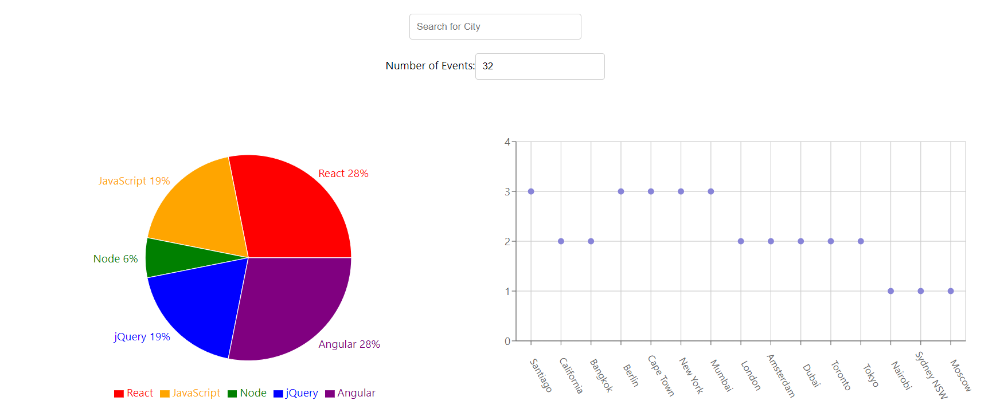

# EventFinder Application Project Description
To build a serverless, progressive web application (PWA) with React using a
test-driven development (TDD) technique. The application practiced test-driven development by exploring Unit, Integration, User-Acceptance and End-to-End testing methodologies.  

The application uses the Google Calendar API to fetch upcoming events from around the world. Two plots will populate showing the subject of the events in a Pie Chart and another will show number of events in the selected location. 

# Link to the EventFinder Application
https://atmackenzie51.github.io/EventFinder/

# Screenshot of the Start Page

# Using Serverless Functions in this Project
The project will use serverless functions to authenticate users, do real-time processing to meet user behavior, provide recommendations to users, and scale depending on the user base. 

# Project Features:
There were a total of 6 features being implemented with this application:
| Number | Feature |
|--------|---------|
|   #1   | [Filter Events by City](#feature-1) |
|   #2   | [Show/Hide Event Details](#feature-2) |
|   #3   | [Specify Number of Events](#feature-3) |
|   #4   | [Use the App when Offline](#feature-4) |
|   #5   | [Add an App Shortcut to the Home Screen](#feature-5) |
|   #6   | [Display Charts visualizing Event Details](#feature-6) |

Each features' scenarios were broken down into User Stories and converted in Gherkin Syntax. Examples can be seen in [Feature 2](#feature-2).

## Feature 1: Filter Events by City
**Scenario 1**: When the user hasn't searched for a city, show upcoming events in all cities.  
**Scenario 2**: User should see a list of suggestions when they search for a city.  
**Scenario 3**: User can select a city from the suggestion list.  

## Feature 2: Show/Hide Event Details
**Scenario 1**: An event element is collapsed by default.  
**Scenario 2**: User can expand an event to see details.  
**Scenario 3**: User can collapse an event to hide details.  

### Feature 2 User Story:
As a user,
I should be able to show and hide event details
So that I can select which events I want further details for without seeing all of them.

### Feature 2 Gherkin Syntax:
**Scenario 1**: Given the system is in its default state
When the user views an event element
Then the event element should be collapsed

**Scenario 2**: Given the user is viewing an event element
When the user chooses to expand the event
Then the details of the event should be visible

**Scenario 3**: Given the user is viewing an expanded event element
When the user chooses to collapse the event
Then the details of the event should be hidden

# Feature 3: Specify Number of Events
**Scenario 1**: When user hasn’t specified a number, 32 events are shown by default.  
**Scenario 2**: User can change the number of events displayed.  

# Feature 4: Use the App When Offline
**Scenario 1**: Show cached data when there’s no internet connection.  
**Scenario 2**: Show error when user changes search settings (city, number of events).  

# Feature 5: Add an App Shortcut to the Home Screen
**Scenario 1**: User can install the meet app as a shortcut on their device home screen.  

# Feature 6: Display Charts Visualizing Event Details
**Scenario 1**: Show a chart with the number of upcoming events in each city.  
